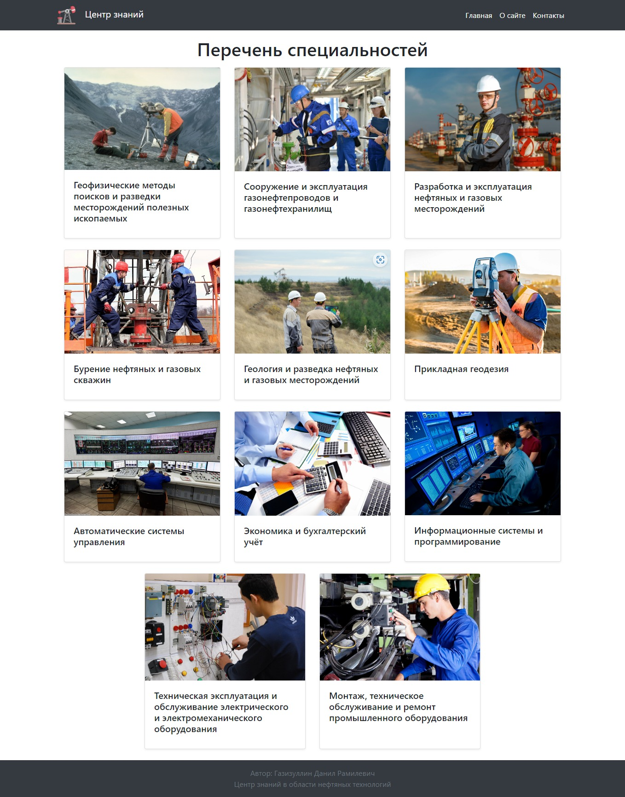
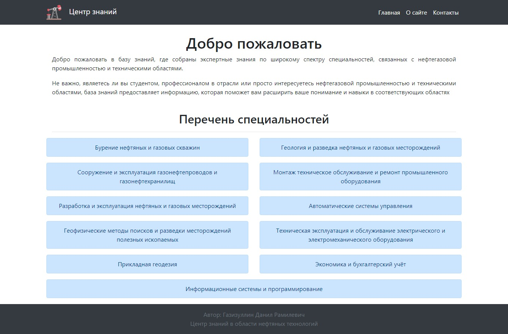
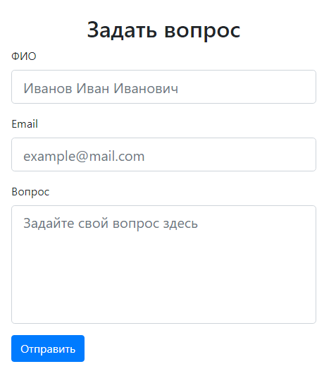
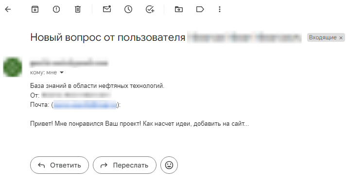
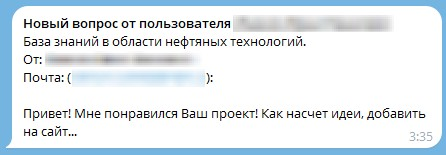

<h1 align="center">OilTech Knowledge Hub</h1>

<h2 align="center">
    
    
    
    
    
</h2>

## Installation

1. Clone this repository: ```https://github.com/gaziikk/oiltech_knowledge_hub.git ```
2. Install ```virtualenv``` : ```python -m venv venv```
3. Activate ```virtualenv``` : ```venv/scripts/activate```
4. cd into ```oiltech_knowledge_hub```: ```cd oiltech_knowledge_hub```.
5. Install ```packages and modules```: ```pip install -r requirements.txt```
6. Run project: ```python manage.py runserver```

## Email and Telegram send messages
> For the correct operation of the logic of sending messages to e-mail, follow these steps

1. Create ```.env``` file: ```echo > .env```
2. Fill in the constants with your values
   ```python
   SECRET_KEY='12fdl;gkh32f;kldmg-EXAMPLE-KEY-dfgoiu832,mndfsg'
   PASSWORD='qqqq wwww eeee rrrr'
   EMAIL='example@gmail.com'
   TOKEN='9012340909:HHSDLFK-EXAMPLE-TG-BOT-TOKEN-upritulkjlkfgdm'
   TELEGRAM_ID='YOUR-TELEGRAM-ID'
   ```
    > SECRET_KEY – django project secret key

    > PASSWORD – to send e-mail messages

    > EMAIL – the email address to which the messages will be sent

    > TOKEN – a token for working with a bot in telegram

    > TELEGRAM_ID – the unique ID in the telegram to which the messages will be sent
    ---
    ### Where can I get a ```SECRET_KEY```?
    + Open ```Python in the terminal```: ```python```
    +  Generate a new secret key:

        ```python
        from django.core.management.utils import get_random_secret_key      
        get_random_secret_key() 
        ```
    +  Django will give you a ```new secret key``` in the form of ```str```
    ---
    ### Where can I get a ```PASSWORD```?
    + Open [Google Account Management](https://myaccount.google.com/).
    + Click **Security**
    + Enable two-factor authentication
    + Scroll down and click on the **application passwords**
    + Select **create**
    + Click **done**
    ---    
    ### Where can I get a ```TOKEN```?
    + Go to the **telegram**
    + **Search** [Bot Father Bot](https://t.me/BotFather)
    + Create a **new bot**, after the bot creation stage, the bot will send you a **token**
    ---
    ### Where can I get a ```TELEGRAM_ID```?
    + Go to the **telegram**
    + **Search** [Get My ID Bot](https://t.me/getmyid_bot)
    + Write **/start** and get your telegram id
## Short description
The website of the knowledge base on petroleum technologies with ```the main page```, the ```description of the site``` and ```the contact information``` **of me (the author)**, including links to social networks and a feedback form.
## Screenshots
<p align="center">
    
</p>
<p align="center">
    
</p>


### Feedback form
---
<p align="center">
    
</p>

> **The user, having filled in the full name, mail and question, sends a message to e-mail and telegram**


---


---

